# Azure Functions
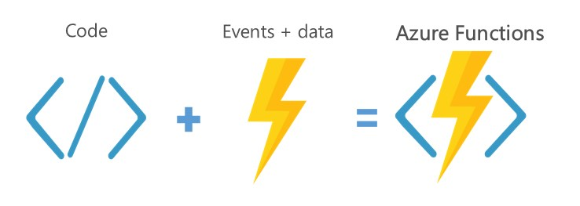

Azure Functions란 마이크로소프트에서 제공하는 서버리스 서비스 입니다. 서버리스 서비스라는 말을 요즘 많이 들어보셨을텐데요, 문자그대로 해석하면 서버가 없다? 당연히 서버는 존재하죠! 하지만 클라우드 서비스에서 이 또한 관리해주고 추상화하여 제공하기 때문에 이를 사용하는 사용자 입장에서는 정말 나의 코드조각만 신경쓰면 됩니다. 이를 잘 표현하기 위해 이름에 Function이란 단어가 포함되었네요! 

유사한 다른 벤더사의 제품으로는 AWS Lambda를 들 수 있습니다. 서버리스 서비스가 주목을 받고 있는 이유는 이를 이용하여 개발시 여러가지 장점을 가저다 주기 때문인데요, 그 중 하나가 확장성입니다. 이벤트 기반으로 동작하는 서비스에 Azure Function이 적합해요. 또한 과금 정책도 매우 합리적이랍니다! 딱 내 Function이 수행되는 만큼만 돈을 지불하면 되거든요! 매우 합리적이죠?

Azure Functions의 장점을 소개하자면, 여러 Binding 옵션을 제공합니다. 이벤트 기반으로 동작하는 서비스에 사용하는 것이 적잘하다고 말씀드렸는데요, 여러 Azure 상의 서비스와 Binding 할 수 있도록 제공하고 있습니다. 예를들어 이미지 리사이징 서비스를 만든다고 가정했을때 Azure Blob Storage와 바인딩하여, 스토리지에 이미지가 업데이트 되면 동작하도록 손쉽게 구성할 수 있습니다. 
이 밖에도 Azure의 Logic App과 궁합이 좋습니다. Azure Logic Apps는 다양한 3rd Party 서비스와의 커넥터 서비스를 제공하는데 이를 적절히 활용한다면 매우 손이 많이 가는 서비스도 쉽게 만들어보실 수 있습니다. 
또한 Azure Functions이 수행되는 런타임을 오픈소스로 공개하였기 때문에 오프라인 디버깅 및 개발이 가능하고 원하는 경우 자신이 가지고 있는 온프레미스 장비에서도 Azure Functions를 수행하실 수 있습니다. 

Azure Functions를 사용하기 위해 별도로 Library나 Framework을 공부하실 필요가 전혀 없어요! Binding 하는 부분 및, Azure Functions가 수행되기 위한 조건 설정에 대한 약간의 지식만 있으시다면 아주 편리하게 사용하실 수 있습니다. 오늘 실습을 통해 이러한 부분들을 같이 연습해 볼 예정이에요 :)


## 실습내용

Blob Storage에 사용자가 이미지를 업로드 하면 Azure Function을 이용하여 이미지 파일을 Cognitive Vision API를 이용하여 분석하고 부적절한 이미지가 업로드 되면 reject 컨테이너에 이미지를 별도로 저장한다. reject 컨테이너에 이미지가 업로드되면 Logic Apps를 활용하여 관리자에게 안내 메일을 전송한다. 

* Part 1. Azure Portal에서 Azure Functions 만들기
* Part 2. 실습에 필요한 리소스 생성 및 BlobTrigger 기능을 하는 Azure Functions 만들기
* Part 3. Local에서 Azure Functions 만들고 디버깅 해보기
* Part 4. Cognitive Service를 이용하여 업로드한 이미지를 분석하는 기능 추가하기
* Part 5. 부적절한 이미지를 Blob Storag의 별도의 컨테이너에 저장하는 기능 추가하기
* Part 6. Azure에 로컬에서 개발한 function 업로드하기 
* Part 7. Logic App을 이용하여 관리자에게 알림메일 전송하기 

## 실습 준비 

(Windows, Mac 공통)
* Azure 계정 활성화 ([portal.azure.com](https://portal.azure.com) 로그인 및 리소스 생성 가능 상태)
  - Azure Pass를 사용하시는 경우 [링크](https://www.microsoftazurepass.com/)를 참고하세요 
* [Node 8.5 이상 (Node Version 9 이하여야 함)](https://nodejs.org/ko/download/)
* [Visual Studio Code](https://code.visualstudio.com/)
* [Azure Storage Explorer](https://azure.microsoft.com/en-us/features/storage-explorer/)
* [.NET Core](https://www.microsoft.com/net/learn/get-started2) 

## 실습 과정
### Part 1. Azure Portal에서 Azure Functions 만들기
1. [Azure Portal](https://portal.azure.com)에 접속한 후 로그인 합니다. 

2. **+ 새로만들기** -> **계산(Compute)** -> **기능 앱(Function App)**을 차례로 클릭합니다.
 

3. 다음과 같이 값을 입력하신 후 **만들기** 버튼을 눌러서 Function을 생성하시기 바랍니다. 
    * 앱 이름: **이니셜-func-날짜(ex. eunji-func-0106)** 
    * 리소스 그룹: 새로만들기 -> **FunctionLabRG**
    * 호스팅 계획: **사용 계획**
    * 위치: **동아시아**
    * 저장소: 새로만들기 -> **이니셜func날짜(ex. eunjifunc0106)**
    
        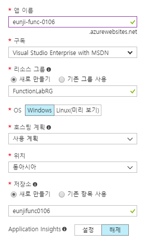

4. 대쉬보드로 돌아와서 좌측 메뉴중에 **리소스 그룹**을 선택하시고, 방금 생성했던 **FunctionLabRG** 리소스 그룹을 선택하여 접속합니다. 
    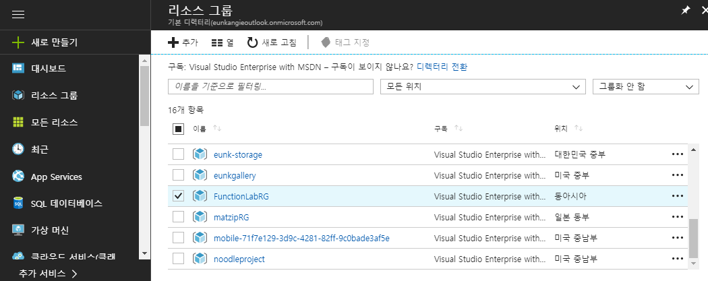

5. 생성된 Azure Functions를 확인하고 선택하여 접속합니다.
    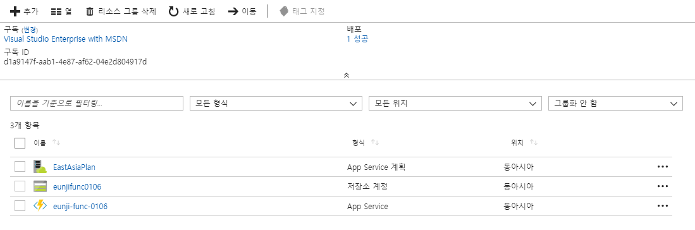

6. 함수 앱 목록에서 함수 옆 **+** 버튼을 클릭하여 새로운 함수를 생성합니다. 

    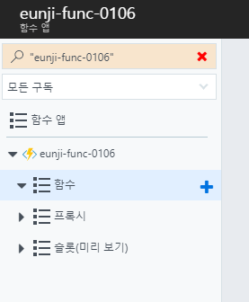

7. **Webhook + API** -> **JavaScript** -> **이 함수 만들기**를 차례로 클릭하여 첫 번재 Azure Functions를 생성합니다. 

    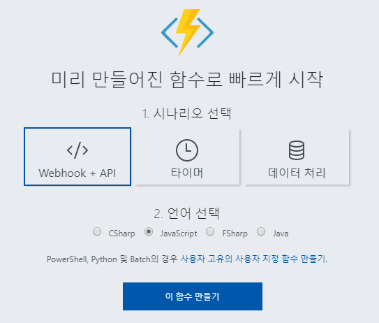

8. 함수 생성이 완료되었습니다. 방금 만든 함수는 HTTP POST 요청으로 값을 보내면 이에 대해 응답을 해주는 아주 간단한 함수입니다. 오른쪽 **테스트** 탭을 확장한 후 아래 부분의 **실행** 버튼을 눌러서 테스트 해보실 수 있습니다. 

    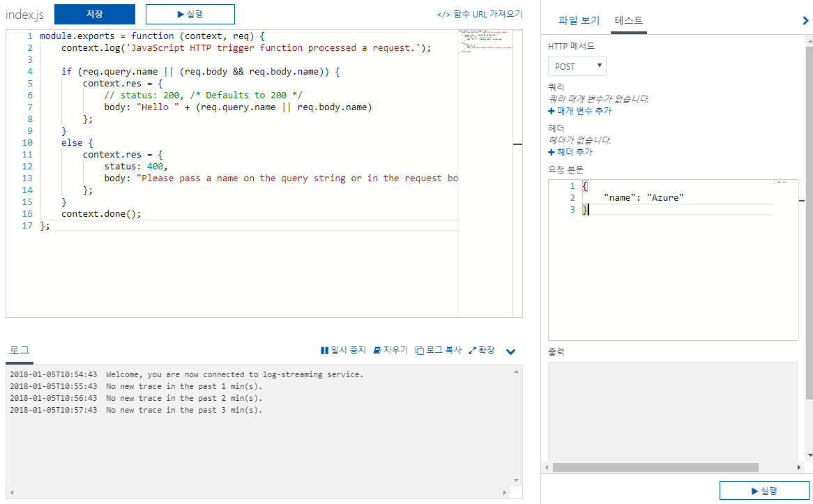
    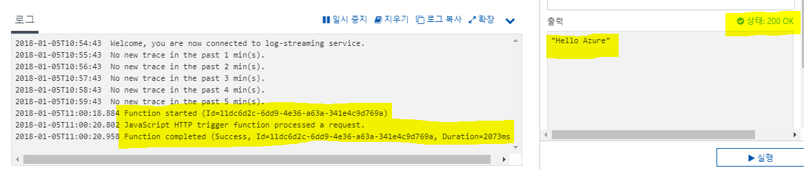

### Part 2. 실습에 필요한 리소스 생성 및 BlobTrigger 기능을 하는 Azure Functions 만들기
1. 대쉬보드에서 **리소스 그룹**을 선택하시고, 위에서 진행했던 것과 같이 **FunctionLabRG** 리소스 그룹을 선택하여 접속한다. 
    

2. **추가** 버튼을 클릭한 후, 검색창에 **app service plan**으로 검색하여 **App Service 계획**을 찾고 선택한 후 **만들기** 버튼을 누른다.

    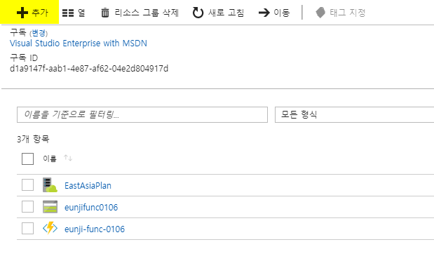    
    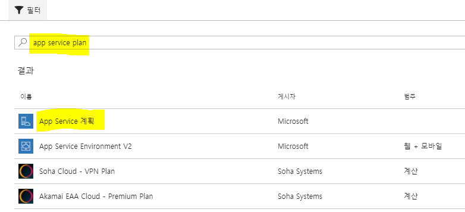

3. 다음과 같이 입력한 후 **만들기** 버튼을 눌러서 App Service 계획을 생성한다. 

    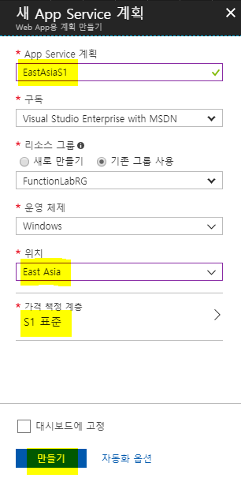

4. 리소스 그룹으로 돌아와서 앞에서 생성핬던 **eunji-func-0106**를 다시 선택한다. 

    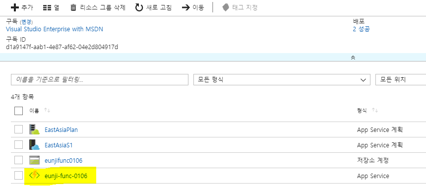

5. **함수** -> **새 함수** 버튼을 차례로 선택한다. 

   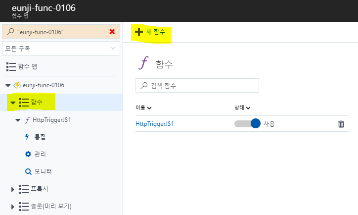

6. **Blob trigger** -> **JavaScript**를 선택한다. 

   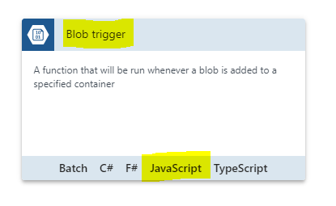

7. 다음과 같이 값을 변경하고 **만들기** 버튼을 눌러서 새 함수를 추가한다. 
    * 이름: **BlobImageAnalysis**
    * Path: **uploaded/{name}**

        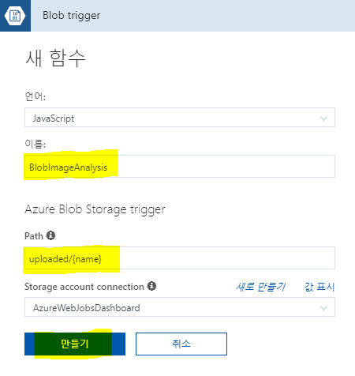

8. 왼쪽 메뉴에서 **Azure Functions 이름(eunji-func-0106)** 선택 후, **개요** 탭 아래의 구성된 기능 중 **응용 프로그램 설정**을 클릭한다. 

   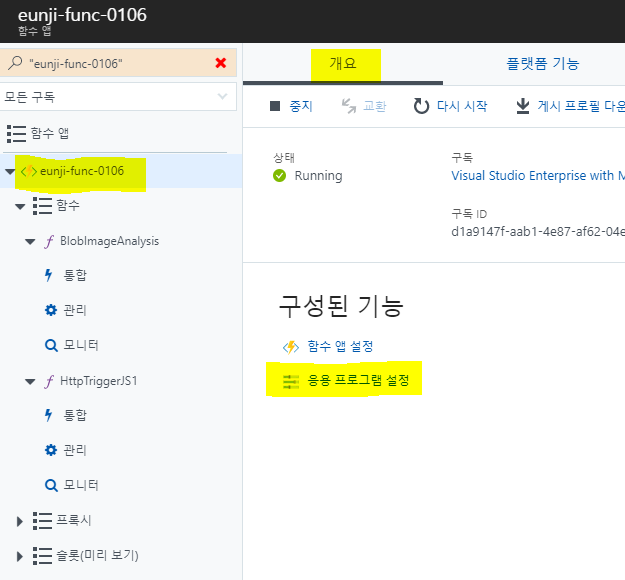

9. **응용 프로그램 설정** 부분에서 **AzureWebJobsDashboard** 값을 확인한다. 

   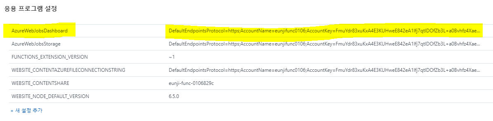

10. Azure Functions와 관련된 기본 코드 및 설정은 완료되었고 Storage와 관련된 작업이 남았다. **Azure Storage Explorer**를 실행하고 Azure 아이디를 이용하여 로그인을 진행한다. 

11. Storage Accounts 목록에서 위에서 생성했던 스토리지(ex.eunjifunc0106)을 선택한 후 **Blob Container**를 확장한다음 마우스 오른쪽 버튼을 클릭하여 **uploaded**란 이름의 컨테이너를 생성한다. 

   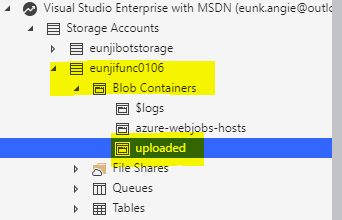

12. uploaded 컨테이너에 가지고 있는 이미지 파일을 업로드 해본다. 

   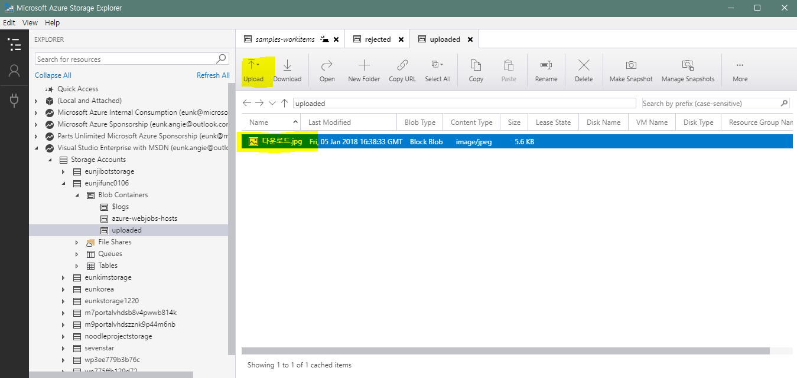

13. 생성했던 BlobImageAnalysis 함수의 로그창에서 이미지 업로드시, Function이 수행되어 로그값이 찍히는 것을 확인할 수 있다. 

   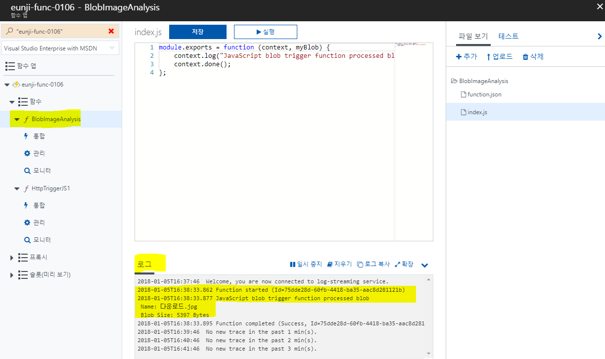

### Part 3. Local에서 Azure Functions 만들고 디버깅 해보기
Reference Link: [https://docs.microsoft.com/en-us/azure/azure-functions/functions-run-local](https://docs.microsoft.com/en-us/azure/azure-functions/functions-run-local)

1. 터미널을 열고 다음의 명령어를 통해 .NET Core에서 동작하는 Azure Functios runtime 2.x 툴을 설치한다. 
```
[Windows]
npm install -g azure-functions-core-tools@core
```

```
[Mac]
sudo npm install -g azure-functions-core-tools@core --unsafe-perm true
```

2. 원하는 디렉토리로 이동한 후 **func init functionslab** 명령어를 입력하여 로컬 Functions 프로젝트를 생성한다. 그리고나서 생성된 하위 디렉토리로 이동한다. 
```
[Windows, Mac 동일]
func init functionslab
cd functionslab
```
   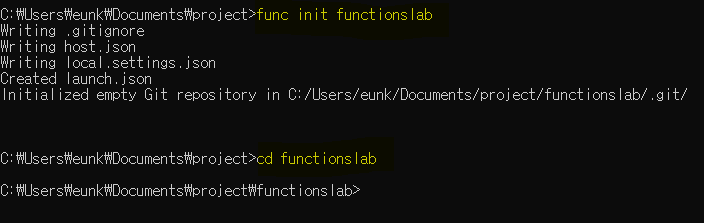

3. **Part 2 - 6**에서 했던 것 처럼 **func new** 명령어를 이용하여 Functions 프로젝트에 새 함수를 추가하고, 템플릿 선택시 **JavaScript** -> **BlobTrigger**를 차례로 선택한다. 함수 이름은 기본값인 BlobTriggerJS 그대로 둔다.  
```
[Windows, Mac 동일]
func new
```
   

4. **func host start**를 입력하여 Azure Functions를 일단 실행해본다. 다음과 같은 에러를 만날 수 있을 것이다. 이는 AzureWebJobStorage의 값이 입력되지 않아서 발생한다. 
```
[Windows, Mac 동일]
func host start
```
   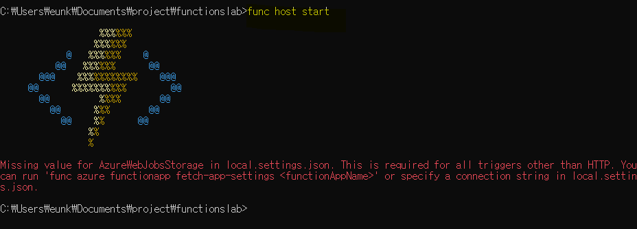

5. Visual Studio Code를 실행하고 functionslab 디렉토리 위치로 이동한다. 

6. 탐색기 탭에서 **local.settings.json**을 오픈한 후, **AzureWebJobStorage** 값이 비어있는 것을 확인한다. 

   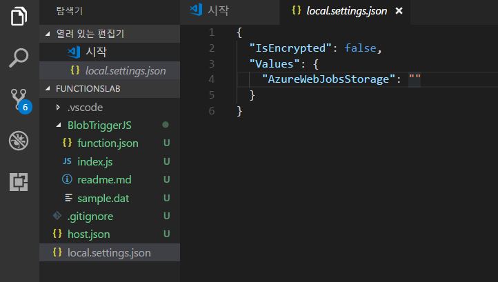

7. **Part 2 - 9**에서 확인했던 값을 복사하여 비어있는 곳에 붙여넣는다.

   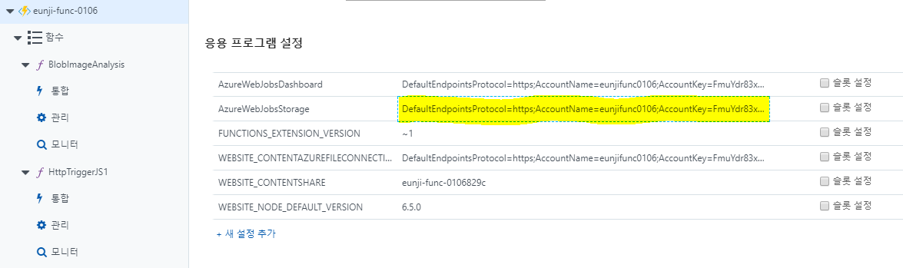
   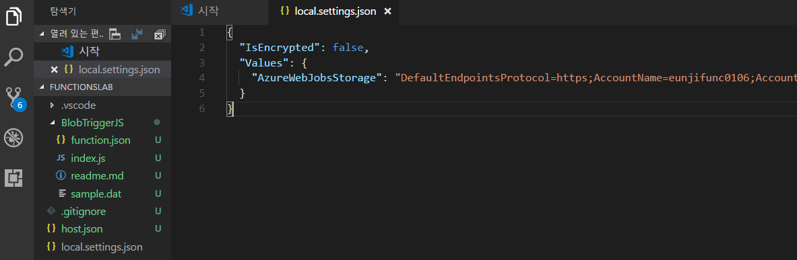

8. 터미널에서 **func host start** 명령어를 입력하여 Azure Functions를 다시 실행해본다. Azure Functions이 문제없이 동작하는지 확인한다. 
```
[Windows, Mac 동일]
func host start
```
   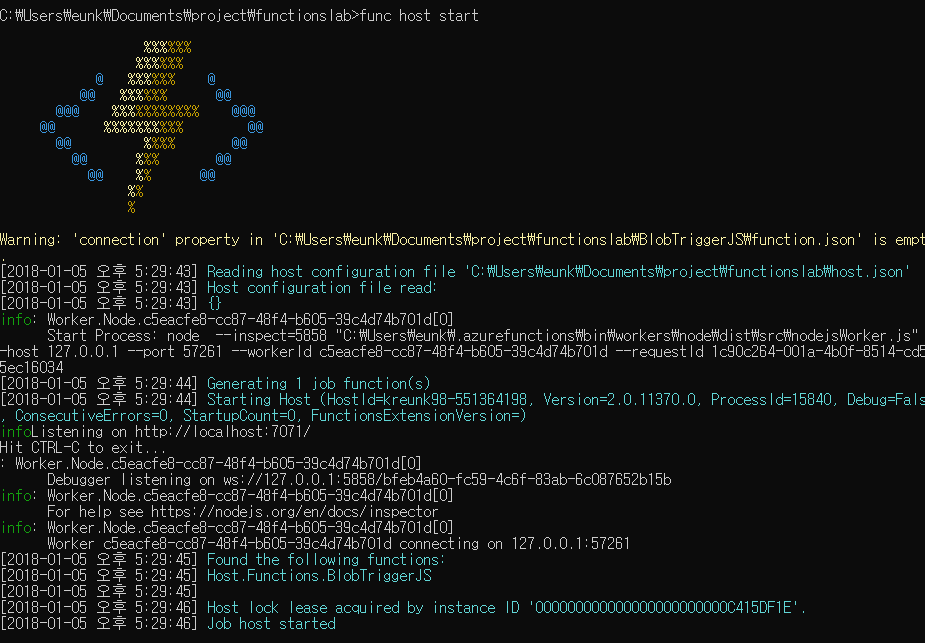

9. **Part 2**에서 만든 함수와 동일하게 동작하도록 하기 위해 몇 가지 값을 바꾸어 주어야한다. Visual Studio Code에서 **function.json** 파일을 열고 **path**와 **connection**에 다음의 값을 입력한다. 
* path: **"uploaded/{name}.jpg"**
* connection: **"AzureWebJobsStorage"**

   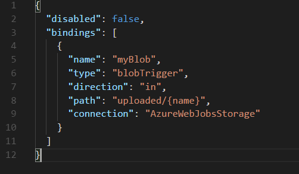

10. Azure에서 동일한 기능을 하는 함수가 똑같이 실행되고 있으므로 테스트를 위해서 그 함수를 중지해야 한다. 다시 Azure Portal로 돌아가서 **함수**탭을 클릭하고 **BlobImageAnalysis**함수의 상태를 **사용안함**으로 변경한다. 

   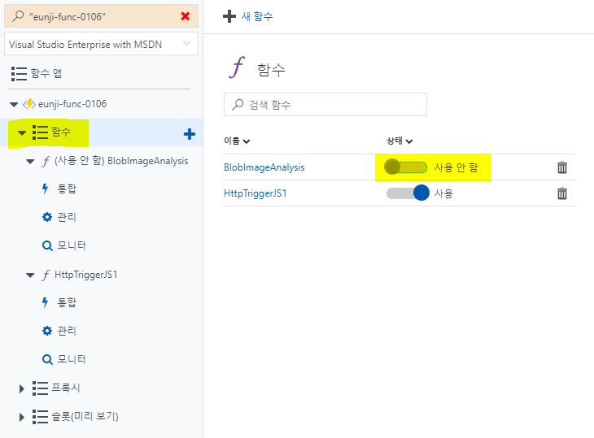

11. Azure Storage Explorer의 uploaded 컨테이너에 다른 이미지를 업로드하여 로컬에서 만든 함수가 잘 작동하는지 확인한다. 

   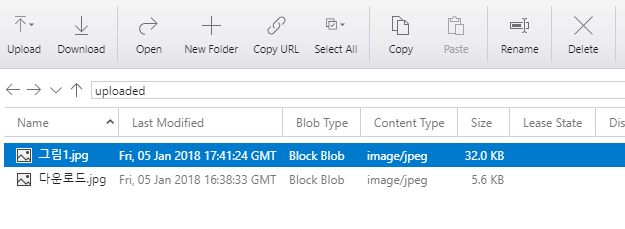
   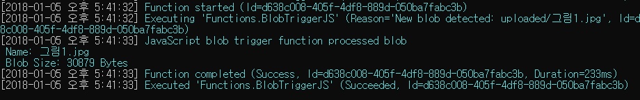

12. 터미널에서  **func host start --debug vscode** 입력후, 디버그 모드로 실행시 Azure Functions 디버깅 가능.

### Part 4. Cognitive Service를 이용하여 업로드한 이미지를 분석하는 기능 추가하기
지금까지는 Blob Storage에 이미지 파일이 업로드 되면 동작하는 Azure Functions를 Azure Portal과 Local에서 각각 만들어 보았다. 이제 [Cognitive Serivce의 Computer Vision 서비스](https://docs.microsoft.com/ko-kr/azure/cognitive-services/computer-vision/home)를 이용하여 이미지 분석기능을 추가해 보도록 하겠다. 

1. Azure Portal의 홈 화면으로 이동한 후 **새로만들기** -> **AI + CognitiveServices** -> **Computuer Vision API**를 차례대로 클릭한다. 

   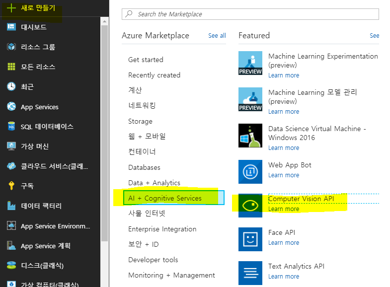

2. 다음과 같이 값을 입력한 후 **만들기** 버튼을 클릭하여 **Computer Vision API** 서비스를 생성한다. 
    * Name: **VisionAPI**
    * 구독: **(기본으로 선택된 값으로)**
    * 위치: **동아시아**
    * 가격 책정 계층: **F0**
    * Resouce group: **기존 그룹 사용 -> FunctionLabRG**
    * **체크박스 표시**

3. FunctionLabRG 리소스 그룹 목록에 **VisionAPI**가 추가된 것을 확인할 수 있다. 

   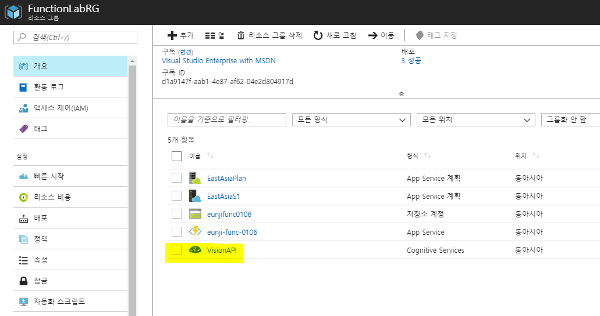

4. Visual Studio Code로 이동한다. BlobTriggerJS 하위의 **index.js** 파일을 오픈한 후 기존의 코드를 전부 삭제하고, 다음의 코드로 대체한다. 
```
var request = require('request-promise');
var azure  =  require('azure-storage');

module.exports = function (context, myBlob) {

context.log("Analyzing uploaded image '" + context.bindingData.name + "' for adult content...");
var options = getAnalysisOptions(myBlob, process.env.SubscriptionKey, process.env.VisionEndpoint);
analyzeAndProcessImage(context, options);

function getAnalysisOptions(image, subscriptionKey, endpoint) {
    return  {
        uri: endpoint + "/analyze?visualFeatures=Adult",
        method: 'POST',
        body: image,
        headers: {
            'Content-Type': 'application/octet-stream',
            'Ocp-Apim-Subscription-Key': subscriptionKey
        }
    }
};

function analyzeAndProcessImage(context, options) {
    request(options)
    .then((response) => {

        response = JSON.parse(response);

        context.log("Is Adult: ", response.adult.isAdultContent);
        context.log("Adult Score: ", response.adult.adultScore);
        context.log("Is Racy: " + response.adult.isRacyContent);
        context.log("Racy Score: " + response.adult.racyScore);

    })
    .catch((error) => context.log(error))
    .finally(() => context.done());
};

};
```
이미지가 업로드 되면 Computer Vision API를 입력하여 사진과 관련된 정보를 출력하는 기능을 한다. 


5. 터미널을 열고 functionslab 디렉토리에서 **npm init** 명령어를 입력한 후, 계속 엔터를 입력하여 package.json 파일을 생성한다.   
```
[Windows, Mac 동일]
npm init
```
   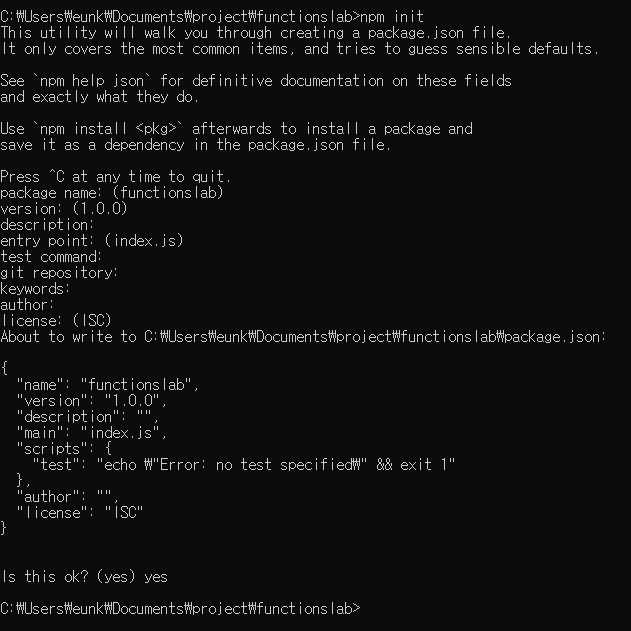

6. 다음의 두 명령을 이용하여 index.js 파일에서 사용하는 node 패키지를 다운로드 받는다.
```
[Windows, Mac 동일]
npm install --save request-promise
npm install --save azure-storage
```
   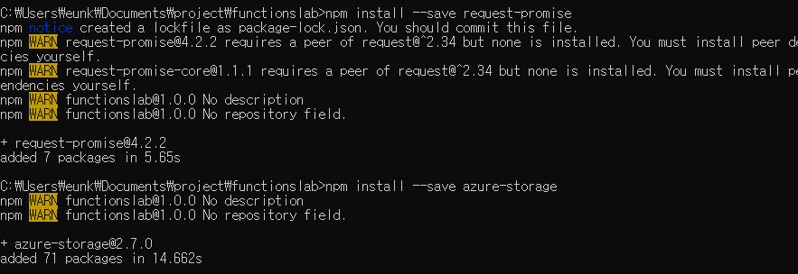


7. 입력한 코드를 실행하기 위해 추가로 입력해주어야 하는 값이 있다. **function.json**을 열고 **"dataType": "binary",**값을 다음과 같이 추가한다. 

   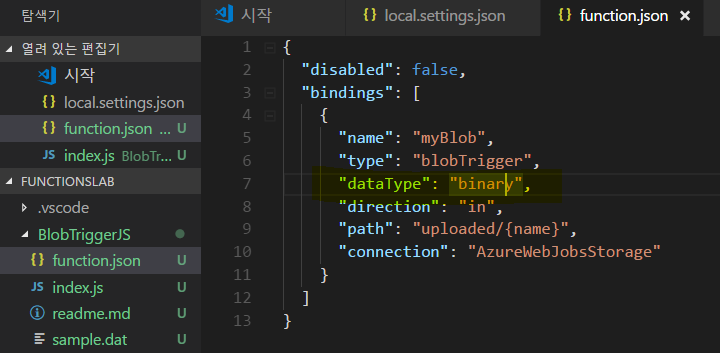

8. **local.settings.json** 파일을 열고 Values에 **SubscriptionKey, VisionEndpoint**를 다음과 같이 추가한다. SubscrptionKey 값은 Azure Portal에서 FunctionsLabRG 리소스 그룹의 VisionAPI에서 확인할 수 있다. 

    * "SubscriptionKey": <VisionAPI - Keys에서 값 확인 가능>,
    * "VisionEndpoint": "https://eastasia.api.cognitive.microsoft.com/vision/v1.0"

    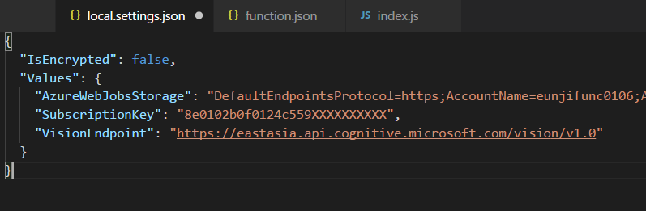
    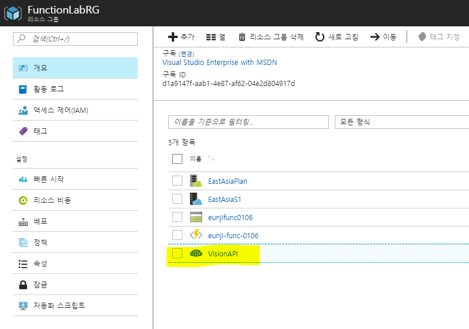
    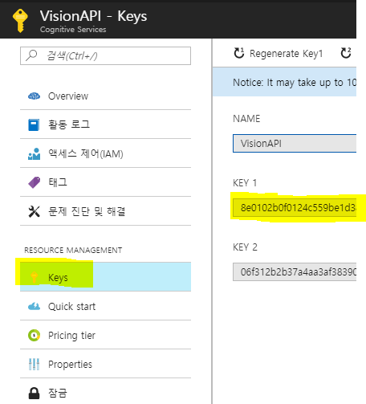

9. 터미널에서 func host start 명령어를 통해 함수를 실행하고, Azure Storage Explorer에서 uploaded 컨테이너에 사진을 업로드하여 잘 동작하는지 확인한다. 

    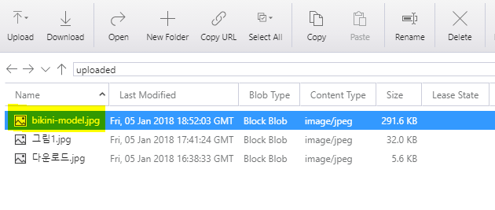
    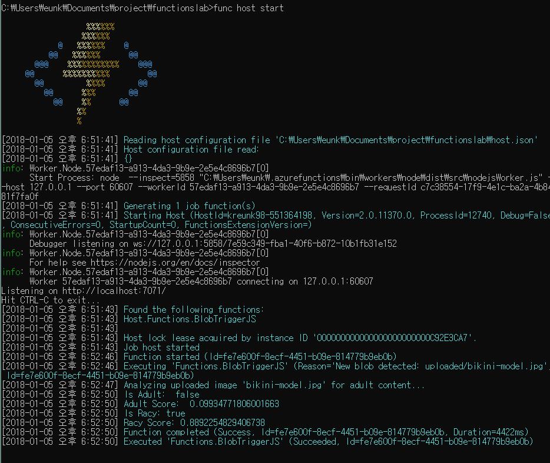

### Part 5. 부적절한 이미지를 Blob Storag의 별도의 컨테이너에 저장하는 기능 추가하기

1. Visual Studio Code에서 **index.js** 파일을 열고 31번째 줄 즈음에 다음의 코드를 추가한다.

```
var fileName = context.bindingData.name
var targetContainer = ((response.adult.isRacyContent) ? 'rejected' : 'accepted')
var blobService = azure.createBlobService(process.env.AzureWebJobsStorage)

blobService.startCopyBlob(getStoragePath('uploaded', fileName), targetContainer, fileName, function (error, s, r) {
if (error) context.log(error)
context.log(fileName + ' created in ' + targetContainer + '.')

blobService.setBlobMetadata(targetContainer, fileName,
    {
    'isAdultContent': response.adult.isAdultContent,
    'adultScore': (response.adult.adultScore * 100).toFixed(0) + '%',
    'isRacyContent': response.adult.isRacyContent,
    'racyScore': (response.adult.racyScore * 100).toFixed(0) + '%'
    },

    function (error, s, r) {
        if (error) context.log(error)
        context.log(fileName + ' metadata added successfully.')
    })
})
```
isRacyContent 값이 True이면 rejected 컨테이너에 그렇지 않은 경우는 accepted 컨테이너에 이미지가 저장된다. 이미지 저장시 관련 메타정보도 함께 저장한다. 

2. **index.js** 파일을 열고 57번째 줄 즈음에 다음의 코드를 추가한다.
```
function getStoragePath (container, fileName) {
    var storageConnection = (process.env.AzureWebJobsStorage).split(';')
    var accountName = storageConnection[1].split('=')[1]
    return 'https://' + accountName + '.blob.core.windows.net/' + container + '/' + fileName + '.jpg'
};
```
저장해야 할 Storage의 경로를 알아내기 위한 함수이다. 

최종 index.js 코드는 다음과 같다. 
```
var request = require('request-promise')
var azure = require('azure-storage')

module.exports = function (context, myBlob) {
  context.log("Analyzing uploaded image '" + context.bindingData.name + "' for adult content...")
  var options = getAnalysisOptions(myBlob, process.env.SubscriptionKey, process.env.VisionEndpoint)
  analyzeAndProcessImage(context, options)

  function getAnalysisOptions (image, subscriptionKey, endpoint) {
    return {
      uri: endpoint + '/analyze?visualFeatures=Adult',
      method: 'POST',
      body: image,
      headers: {
        'Content-Type': 'application/octet-stream',
        'Ocp-Apim-Subscription-Key': subscriptionKey
      }
    }
  };

  function analyzeAndProcessImage (context, options) {
    request(options)
    .then((response) => {
      response = JSON.parse(response)

      context.log('Is Adult: ', response.adult.isAdultContent)
      context.log('Adult Score: ', response.adult.adultScore)
      context.log('Is Racy: ' + response.adult.isRacyContent)
      context.log('Racy Score: ' + response.adult.racyScore)

      var fileName = context.bindingData.name
      var targetContainer = ((response.adult.isRacyContent) ? 'rejected' : 'accepted')
      var blobService = azure.createBlobService(process.env.AzureWebJobsStorage)

      blobService.startCopyBlob(getStoragePath('uploaded', fileName), targetContainer, fileName, function (error, s, r) {
        if (error) context.log(error)
        context.log(fileName + ' created in ' + targetContainer + '.')

        blobService.setBlobMetadata(targetContainer, fileName,
          {
            'isAdultContent': response.adult.isAdultContent,
            'adultScore': (response.adult.adultScore * 100).toFixed(0) + '%',
            'isRacyContent': response.adult.isRacyContent,
            'racyScore': (response.adult.racyScore * 100).toFixed(0) + '%'
          },

            function (error, s, r) {
              if (error) context.log(error)
              context.log(fileName + ' metadata added successfully.')
            })
      })
    })
    .catch((error) => context.log(error))
    .finally(() => context.done())
  };

  function getStoragePath (container, fileName) {
    var storageConnection = (process.env.AzureWebJobsStorage).split(';')
    var accountName = storageConnection[1].split('=')[1]
    return 'https://' + accountName + '.blob.core.windows.net/' + container + '/' + fileName + '.jpg'
  };
}
```

3. Azure Storage Explorer를 열고 uploaded 컨테이너가 포함된 동일한 Blob Container 아래에 **accepted, rejected** 두개의 컨테이너를 위에서 했던 방식과 동일하게 추가한다. 

    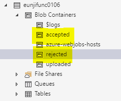

4. 터미널에서 **func host start** 명령어로 함수를 실행시킨 상태에서 **uploaded** 컨테이너에 **.jpg**확장자로 끝나는 이미지 사진을 업로드하면 함수가 수행되는 것을 확인할 수 있다. 

    
    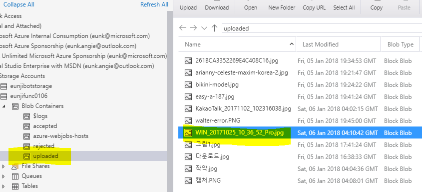
    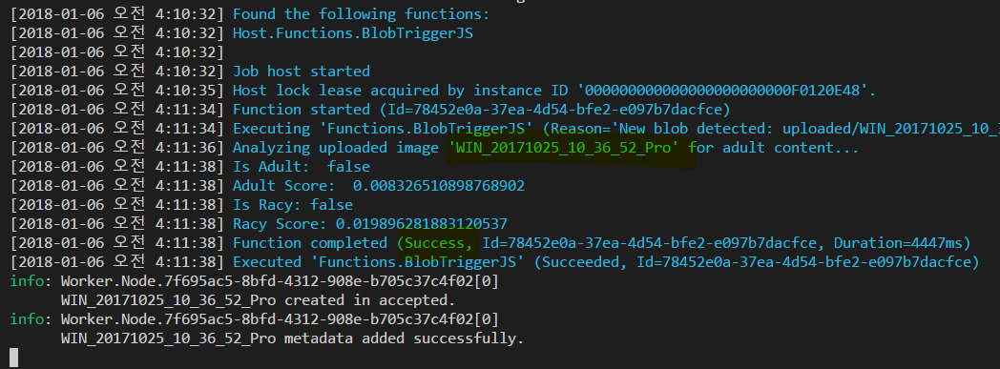
    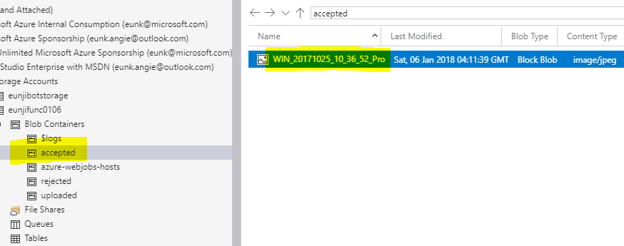

### Part 6. Azure에 로컬에서 개발한 function 업로드하기 

1. 이제 완성한 함수를 Azure에 배포하는 일만 남았다! 터미널을 열고 **func azure account list** 명령어를 입력하여 Part1 에서 생성한 Azure Functions이 위치한 구독과 동일한 구독이 지정되어 있는지 확인한다. (구독이 1개인 분들은 걱정할 필요 없다)

```
func azure account list
```
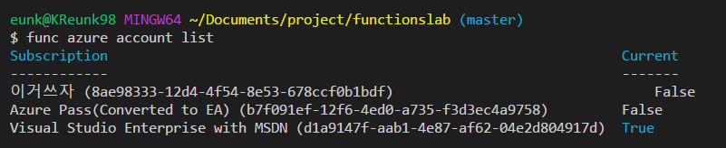

2. **func azure functionapp publish <FunctionAppName>**을 입력하여 로컬에서 개발한 펑션을 Azure로 업로드한다. <FunctionAppName>은 **Part 1 - 3**에서 지정한 값으로 나의 경우는 eunji-func-0106이다. 
```
func azure functionapp publish <FunctionAppName>
```
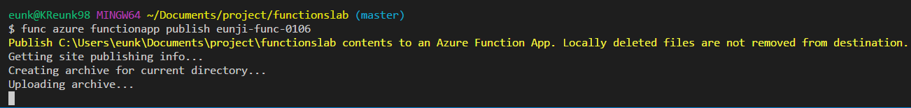

3. Azure Portal에 접속하여 위에서 생성했던 Azure Functions 관리화면으로 접속한다. **BlobTriggerJS**라는 함수가 추가된 것을 확인할 수 있다. 

    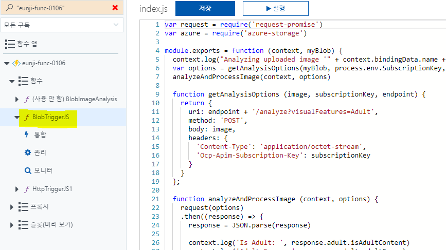

4. 이상태에서 실행하면 에러가 발생한다. 필요한 node 패키지가 추가되지 않았기 때문이다. 좌측의 메뉴에서 **함수 이름**을 클릭하고 **플랫폼 기능** 탭을 클릭한 후, 하단의 **고급 도구** 메뉴를 클릭한다. 

    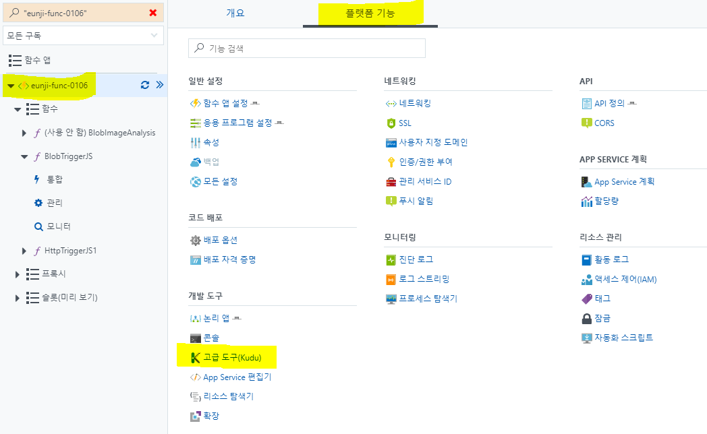

5. 새로 열린 창에서 **Debug console** -> **CMD** 를 선택한다.

    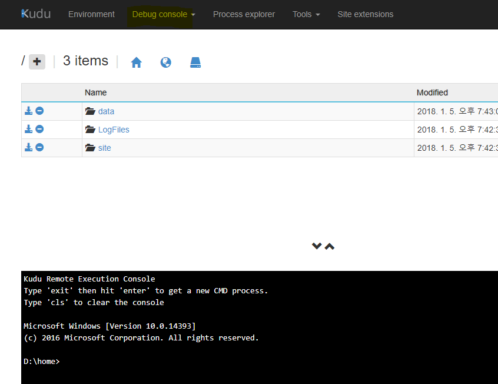

6. **home\site\wwwroot** 경로로 이동하여 다음의 두 명령어를 입력한다. 
```
npm install --save request-promise
npm install --save azure-storage
```

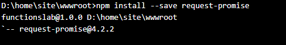
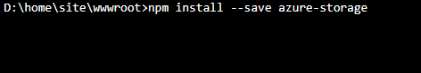

7. Azure Functions을 관리할 수 있는 페이지에서  **함수이름 선택** -> **플랫폼 기능** -> **응용 프로그램 설정** 을 차례로 선택하여 환경변수를 관리할 수 있는 페이지로 접속한다.  

    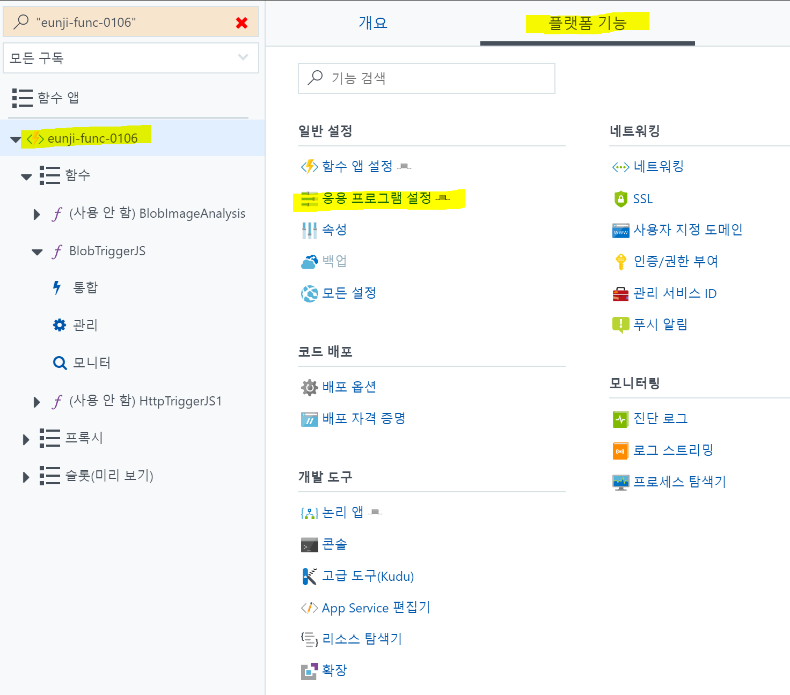

8. **새 설정 추가** 버튼을 클릭하여 **Part 4 - 8** 부분에서 입력한 Vision API 키 값 및 Endpoint 값을 추가해 주어야한다. 이 부분을 추가로 작업해주어야 하는, 이유는 로컬에서 Azure Functions를 개발할 때 환경변수를 저장했던 **local.settings.json** 내의 값들이 Azure에 배포시 반영이 되지 않았기 때문이다. 

    * "SubscriptionKey": **<VisionAPI - Keys에서 값 확인 가능>**
    * "VisionEndpoint": **"https://eastasia.api.cognitive.microsoft.com/vision/v1.0"**
     
    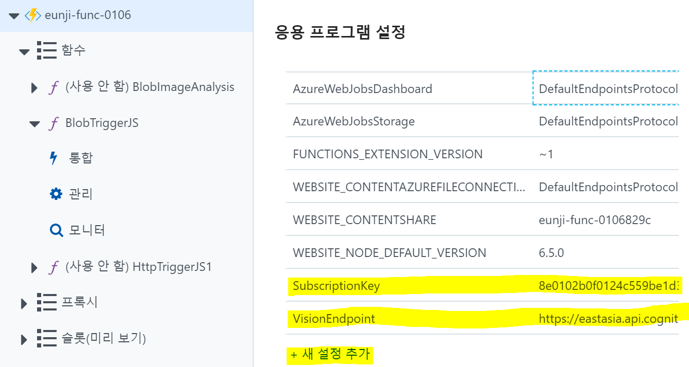

9. 위의 설정을 마무리 하고 **uploaded** 컨테이너에 **.jpg**확장자로 끝나는 이미지 사진을 업로드하면 함수가 수행되는 것을 확인할 수 있다. 

    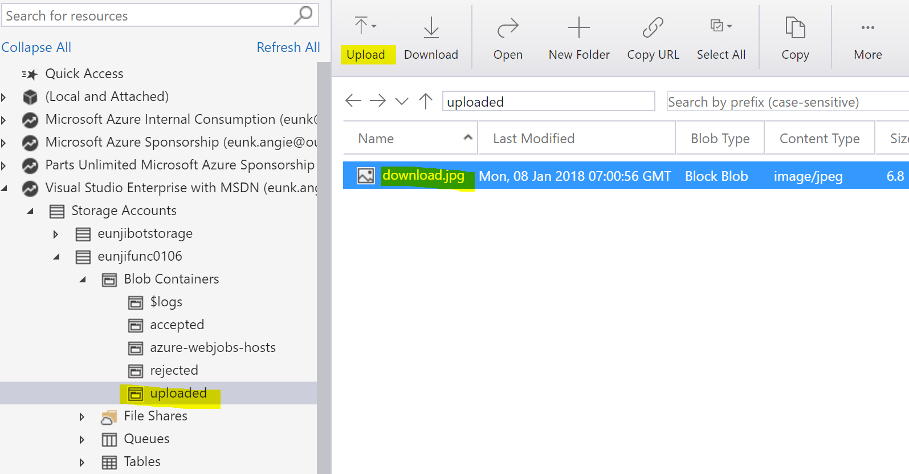
    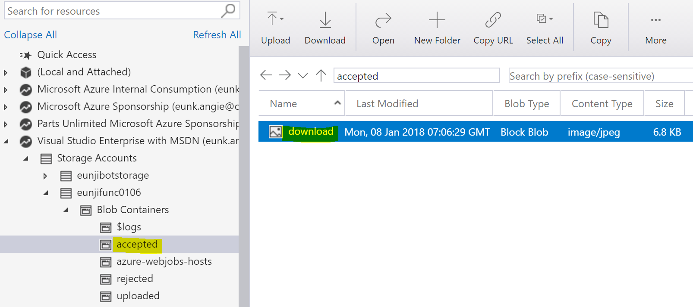

### Part 7. Logic Apps를 이용하여 관리자에게 알림메일 전송하기 
이번 단계에서는 Azure Functions와 함께 사용하면 궁합이 좋은 Logic Apps을 활용해보는 실습을 해보도록 하겠습니다. Logic Apps 란 코드를 단 한줄도 작성하지 않고도 비주얼 디자이너를 통해 자동화 프로세스를 구성하실 수 있습니다.  

1. Azure Portal 에서 **새로만들기** -> **웹 + 모바일** -> **Logic App**을 차례로 선택한다.

    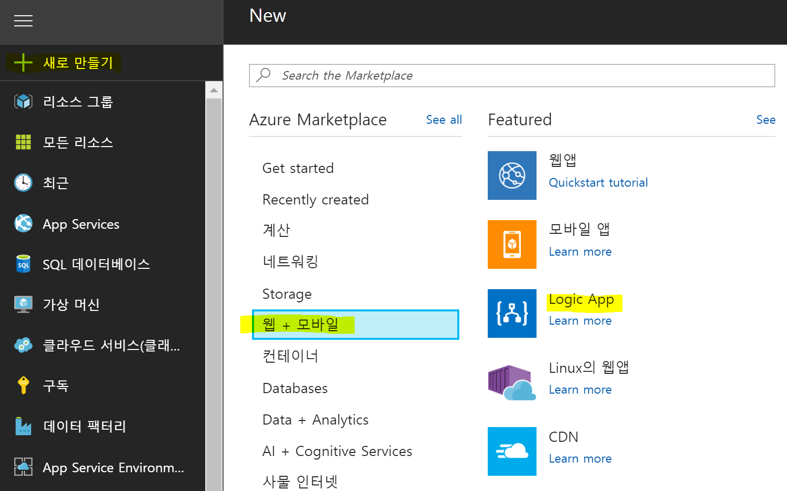

2. 다음의 값을 차례로 입력하여 Logic Apps를 생성한다. 

* 이름 : **이니셜-logic-날짜(ex. eunji-logic-0106)**
* 구독 : **<선택된 값 그대로 둔다>**
* 리소스 그룹 : **기존 그룹 사용** -> **FunctionLabRG**

    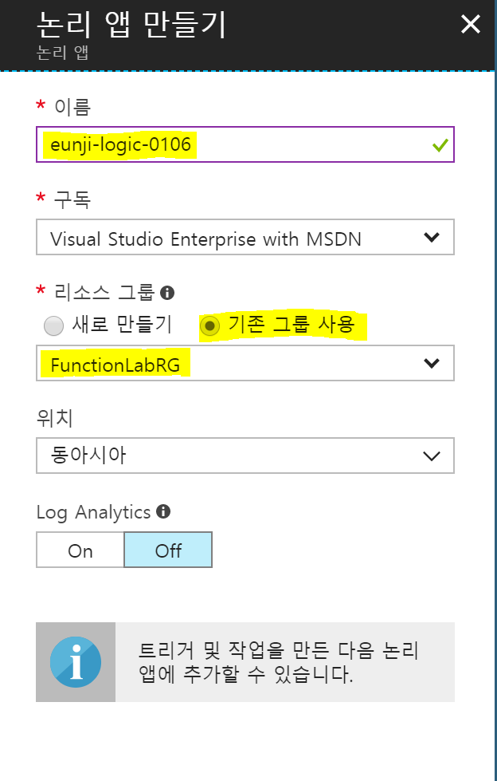

3. 생성된 Logic Apps에 접속하면 다음과 같은 **논리 앱 디자이너** 페이지가 나온다. 페이지 중간에 위치한 **비어 있는 논리 앱**을 선택한다. 

    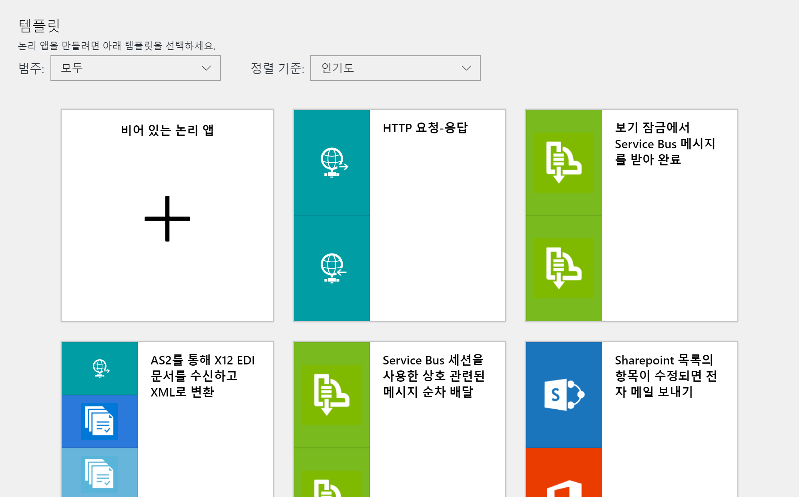

4. 검색 창에 **blob**을 입력한 후, 검색 결과 중 트리거 항목에 있는 **Azure Blob Storage 트리거**를 선택한다. 

    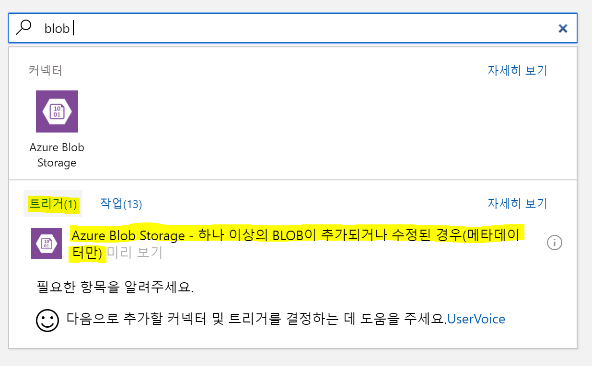
